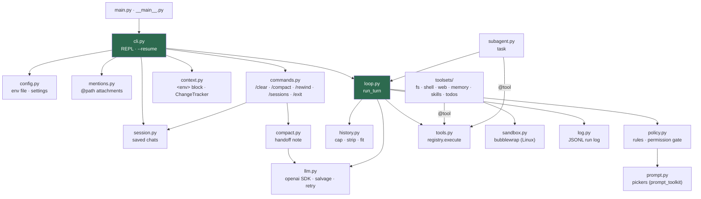

# Architecture

`make_harness` is one loop around one function. `cli.py` assembles the
pieces once per session; `loop.run_turn()` runs once per user message,
calling the model, executing the tools it asks for, and feeding the
results back until the model answers in prose. A subagent is the same
`run_turn` on a fresh message list. Everything else is a leaf that the
CLI, the loop or a command calls into.

## Runtime call graph

`ui.py` (ANSI helpers) and `toolsets/__init__.py::truncate` are shared
leaves used by several nodes above; they are left off the graph to keep
it readable. `toolsets/todos.py` feeds `context.py` through the REPL,
which passes the rendered plan into each request's block.

## Components

| Component | Role | Called by |
|---|---|---|
| `cli.py` | Builds the system prompt (memory and skills indexes, sandbox note), wires the pieces together, runs the REPL; saves, sweeps and strips after each turn, then compacts when needed | `main.py`, `python -m make_harness` |
| `config.py` | Loads `./.env` or `~/.agents/env`; `backend()` returns `BASE_URL` / `API_KEY` / `MODEL`; `CONTEXT_WINDOW`, `COMPACT_AT`, `COMPACT_TO` | imported first by `cli.py`; `llm.py`, `history.py`, `compact.py` |
| `llm.py` | `LLMClient.complete` over the openai SDK: plain-dict result, normalized usage (also kept as `last_usage`), Groq `tool_use_failed` salvage, temperature retry | `loop.py`, `compact.py` |
| `loop.py` | `run_turn`: up to 15 requests; fits the context, adds the reminder block, repairs bad tool arguments, short-circuits verbatim repeats, stops on a user denial, reports a rule's block | `cli.py`, `subagent.py` |
| `tools.py` | `@tool` turns a function into a JSON schema (or takes `parameters=`); `registry.execute` wraps exceptions as text; `without()` builds a subagent's toolset | toolsets register into it, `loop.py` executes |
| `toolsets/` | `read_file`, `write_file`, `str_replace`, `run_command`, `web_search`, `http_request`, `save_memory`, `read_memory`, `load_skill`, `write_todos` | the model, through the registry |
| `subagent.py` | `task`: `run_turn` on a fresh transcript with write tools withheld; returns only the report | the model, through the registry |
| `policy.py` | `SHELL_RULES` per command and project-path gating for writes decide allow / ask / block; the rest asks yes / no / always / deny through its `_ask` seam | `loop.py` |
| `sandbox.py` | Wraps shell commands in bubblewrap on Linux: read-only filesystem except the project and `/tmp`, no network | `toolsets/shell.py`, `cli.py` |
| `history.py` | `cap` trims a fresh result and spills the whole to a temp file; `sweep`, `strip` after a turn; `fit` before a request; never touches the frozen prefix | `toolsets/`, `loop.py`, `cli.py`, `compact.py` |
| `compact.py` | `needed` (server `prompt_tokens` vs the window) and `compact`: system + `
` handoff note + recent tail | `cli.py`, `commands.py` |
| `context.py` | `reminder` builds the `<env>` / `<todos>` / `<system-reminder>` block, `with_reminder` attaches it to a request copy; `ChangeTracker` diffs `git status` between turns | `cli.py`, `loop.py` |
| `session.py` | `Session`: append-only JSONL per chat under `~/.agents/sessions/<project>/`, with `rewind_to` / `replace` entries; `list`, `open`, `preview` | `cli.py`, `commands.py` |
| `commands.py` | Slash-command registry; commands take `(messages, Context)`; `reopen` makes a loaded chat current | `cli.py` |
| `prompt.py` | The `@path` completer, the choice dropdown and input history; both fall back to plain `input()` off a TTY | `cli.py`, `policy.py` |
| `mentions.py` | Expands `@path` into attachment blocks, capped head plus tail | `cli.py` |
| `log.py` | `RunLog.event`: one JSONL line per event, one file per session | `cli.py`, `loop.py`, `compact.py`, `commands.py`, `subagent.py` |
| `ui.py` | `bold`, `dim`, `yellow`, `cyan`; pass-through off a TTY or with `NO_COLOR` | `cli.py`, `loop.py`, `policy.py`, `subagent.py`, `toolsets/todos.py` |

## State on disk

| Path | Written by | Read by |
|---|---|---|
| `logs/<stamp>_<run>.jsonl` (launch directory) | `log.py` | you, when debugging a session |
| `~/.agents/sessions/<project>/<id>.jsonl` | `session.py` | `--resume`, `/sessions` |
| `memory/*.md`, `memory/MEMORY.md` (launch directory) | `save_memory` | `read_memory`; the index goes into the system prompt |
| `.agents/skills/<name>/SKILL.md`, `~/.agents/skills/<name>/SKILL.md` | you | `load_skill`; the index goes into the system prompt |
| `~/.agents/history` | `prompt.py` | the REPL's up arrow |
| `.env`, `~/.agents/env` | you | `config.py` at startup |
| `make-harness-*.txt` (system temp dir) | `history.cap` | `read_file`, until the turn ends |

## Known gaps

- There is no text-parsed fallback for models without native tool
  calling (plan.md, Stage 9).
- There is no sandbox on Windows or macOS; there the permission rules are
  the only limit on shell commands.
- A cut tool result's temp file lives only for the turn; the agent has to
  page through it before answering.
