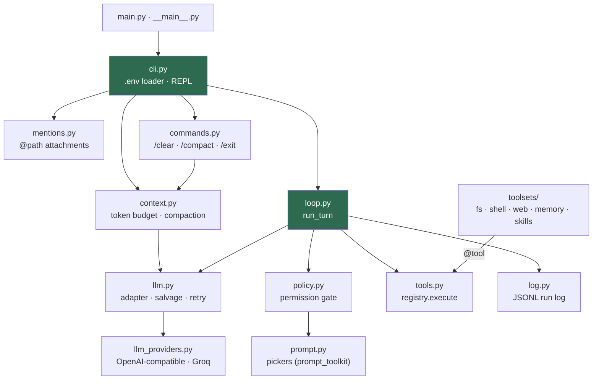

# Architecture

`make_harness` is one loop around one function. `cli.py` assembles the
pieces once per session; `loop.run_turn()` runs once per user message,
calling the model, executing the tools it asks for, and feeding the
results back until the model answers in prose. Everything else is a leaf
that either the CLI or the loop calls into.

## Runtime call graph

`ui.py` (ANSI helpers) and `toolsets/__init__.py::truncate` are shared
leaves used by several nodes above; they are left off the graph to keep
it readable.

## Components

| Component | Role | Called by |
|---|---|---|
| `cli.py` | Loads `.env`, builds the system prompt (memory and skills indexes), runs the REPL | `main.py`, `python -m make_harness` |
| `loop.py` | `run_turn`: up to 15 LLM round trips; repairs bad tool arguments, short-circuits verbatim repeats, stops on a denial | `cli.py` |
| `llm.py` | `LLMClient.complete`: normalizes the backend reply, salvages Groq `tool_use_failed`, retries at rising temperature | `loop.py`, `context.py` |
| `llm_providers.py` | The only HTTP code: `OpenAICompatibleModel`, `GroqChatModel`, the `get_llm_client()` factory | `llm.py` |
| `tools.py` | `@tool` turns a function into a JSON schema; `registry.execute` wraps exceptions as text results | toolsets register into it, `loop.py` executes |
| `toolsets/` | `read_file`, `write_file`, `run_command`, `web_search`, `http_request`, `save_memory`, `read_memory`, `load_skill` | the model, through the registry |
| `policy.py` | Auto-allows read-only tools; asks yes / no / always / deny for the rest through its `_ask` seam | `loop.py` |
| `prompt.py` | The `@path` completer and the choice dropdown; both fall back to plain `input()` off a TTY | `cli.py`, `policy.py` |
| `context.py` | `compact`: stub old tool results, summarize the middle, stub recent results, in that order | `cli.py`, `commands.py` |
| `mentions.py` | Expands `@path` into attachment blocks, capped head plus tail | `cli.py` |
| `commands.py` | Slash-command registry; ships `/clear`, `/compact` and `/exit` | `cli.py` |
| `log.py` | `RunLog.event`: one JSONL line per event, one file per session | `cli.py`, `loop.py`, `context.py`, `commands.py` |
| `ui.py` | `bold`, `dim`, `yellow`, `cyan`; pass-through off a TTY or with `NO_COLOR` | `cli.py`, `loop.py`, `policy.py` |

## State on disk

All paths are relative to the directory `make-harness` is launched from.

| Path | Written by | Read by |
|---|---|---|
| `logs/<stamp>_<run>.jsonl` | `log.py` | you, when debugging a session |
| `memory/*.md`, `memory/MEMORY.md` | `save_memory` | `read_memory`; the index goes into the system prompt |
| `skills/<name>/SKILL.md` | you | `load_skill`; the index goes into the system prompt |
| `.env` | you | `cli.py` at startup |

## Known gaps

- There is no text-parsed fallback for models without native tool
  calling (plan.md, Stage 9).
